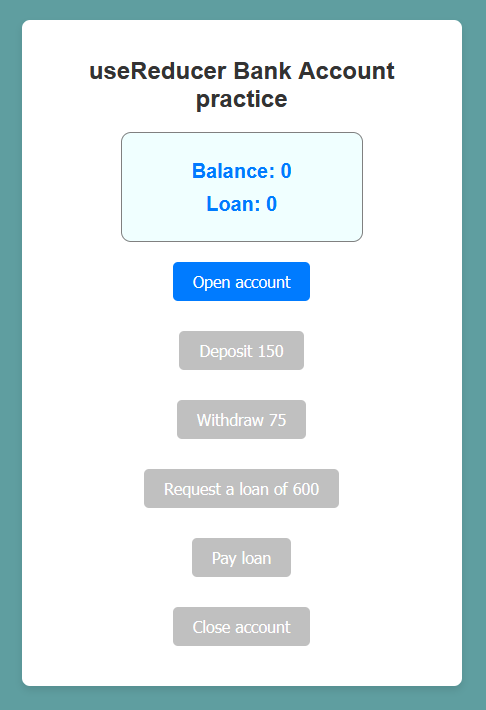

# React - useReducer Bank Account

# 🔗 [Live Preview](https://harmonious-parfait-ceef03.netlify.app/)

---

## About Project 👋

This project is a simple fake banking app built with React using the useReducer hook. The app allows users to manage their bank account with functionalities like opening an account, depositing and withdrawing money, requesting and repaying a loan, and closing the account. 

The key goal is to demonstrate the use of the useReducer hook to manage complex state logic in future bigger projects, making it easier to handle multiple actions that affect the same state.

---

## Features 👨‍💻

- **Open Account:** Allows the user to open an account with an initial deposit. Once the account is opened, further actions become available.

- **Deposit Money:** Enables the user to deposit money into their account, increasing the balance.

- **Withdraw Money:** Lets the user withdraw money from their account if there is a sufficient balance.

- **Request Loan:** Provides a feature to request a loan. The loan amount is added to the account balance, and the loan remains active until repaid.

- **Pay Loan:** Allows the user to pay off the loan, reducing both the loan balance and the account balance.

- **Close Account:** Permits the user to close their account if there is no remaining balance or outstanding loan.

---

## How it works ⚙️

#### `App` Component

- The `App` component is the main component that manages the state of the bank account using the `useReducer` hook. It defines the initial state, sets up the reducer function, and provides the user interface for interacting with the bank account.

#### `reducer` Component

- The `reducer` function handles different actions like opening an account, depositing money, withdrawing money, requesting a loan, paying off the loan, and closing the account. Each action updates the state based on the current state and the dispatched action.

#### `initialState` Component

- This is the initial state of the bank account, which includes `balance`, `loan`, and `isActive`. It ensures that the account starts in a default state before any actions are taken.

---

## Technologies & Dependencies used 📦

- **React:** Core framework for building the user interface and handling component-based architecture.

- **useReducer:** React hook for managing complex state logic in the application, particularly useful for handling multiple actions that affect the state.

- **CSS:** Basic styling for a clean and responsive layout.

dependencies:

- "@testing-library/jest-dom": "^5.17.0",
- "@testing-library/react": "^13.4.0",
- "@testing-library/user-event": "^13.5.0",
- "react": "^18.3.1",
- "react-dom": "^18.3.1",
- "react-scripts": "5.0.1",
- "web-vitals": "^2.1.4"

devDependencies:

- "@babel/plugin-proposal-private-property-in-object": "^7.21.11",
- "@babel/plugin-transform-private-property-in-object": "^7.24.7"

---

## Prerequisites 📚

Ensure you have the following installed on your system:

    Node.js
    npm or yarn
    Git

---

## Clone & Run locally 🏃‍♂️

1. **Clone the Repository:**

   - On the GitHub repo page, click the green "Code" button.

   - Copy the HTTPS URL.

2. **Open the Terminal:**

   - Open the terminal by typing "cmd" in your desktop's start menu, **OR**

   - Right-click on the desktop and select "Git Bash Here" (if you have Git Bash installed), **OR**

   - Open Visual Studio Code's terminal by clicking "Terminal" -> "New Terminal" inside the editor.

3. **Navigate to Your Project Location:**

   - In the terminal, navigate to your desired location (e.g., desktop) using the command: `cd desktop`. Adjust the path if your project is located elsewhere.

   - Ensure that your terminal's address is inside the project folder.

4. **Clone the Repository:**

   - Run the command: `git clone /link/`. Replace `/link/` with the HTTPS URL from step 1.

5. **Enter the Project Directory:**

   - Navigate into the cloned repository by typing: `cd /folder-name/`. Replace `/folder-name/` with the name of the cloned folder.

6. **Install Dependencies:**

   - Run the command: `npm install` to install all the necessary dependencies.

7. **Start the Project:**

   - Run the command: `npm start` or `yarn start` to start the project. It will open in your default browser at [localhost:3000/](http://localhost:3000/)

---

## Project Structure 📂

useReducer-bank-account  
├── public  
├── src  
│   ├── App.js  
│   ├── index.css  
│   ├── index.js  
├── package.json  
└── README.md  

---
